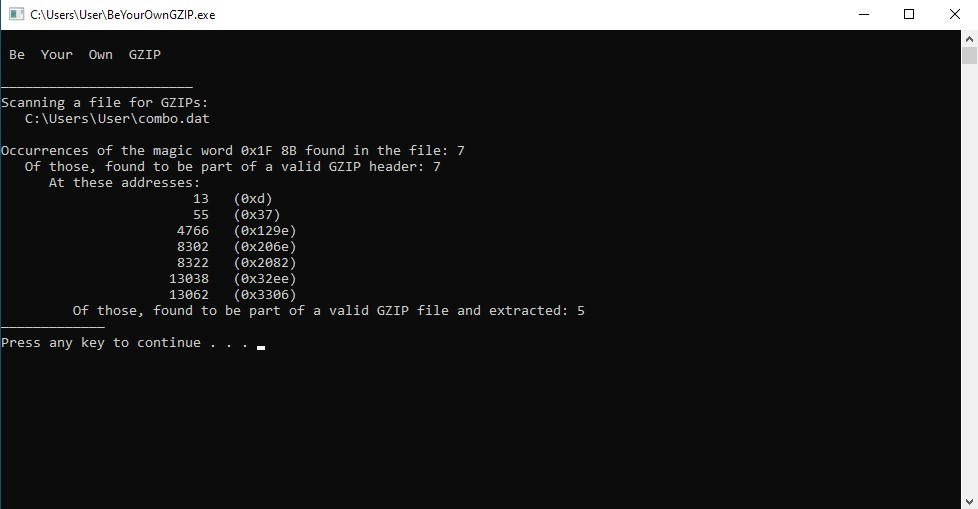

# Be Your Own GZIP
A tool to extract GZIP files from binary files.

The tool will scan a binary file for the start of a GZIP header, and if any is found, it will follow the GZIP format specification to validate the GZIP file and locate its end. All found GZIPs will be extracted to a folder created next to the binary file.

Windows; Visual Studio 2019 solution.

## Usage
Drag and drop a file (or files) that is to be scanned onto the executable.

